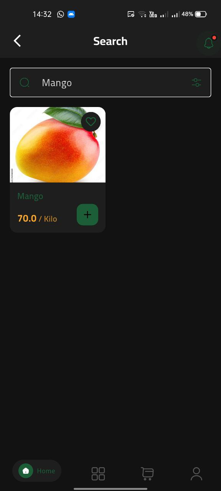
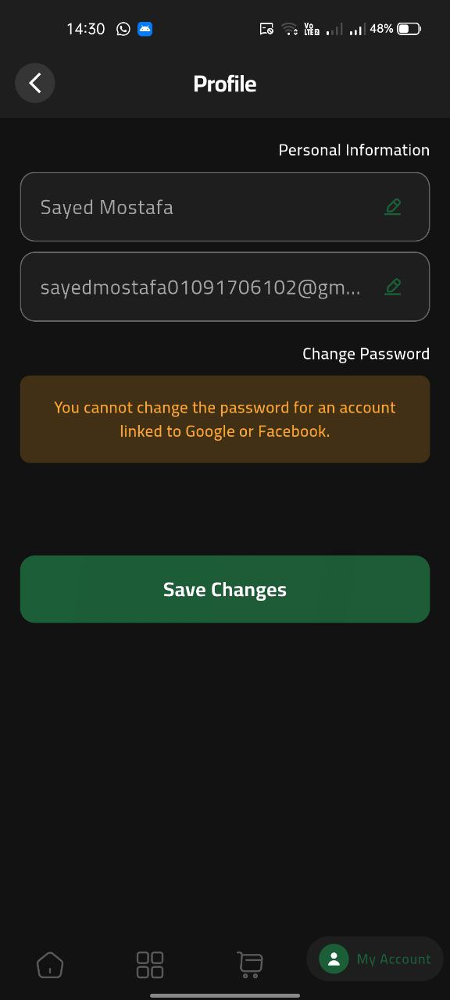

# 🍎 Fruits E-Commerce App

<div align="center">
  
  
  <h3>🌟 A Modern Flutter E-Commerce Experience for Fresh Fruit Shopping 🌟</h3>
  
  
  
  
  
  
  
  <p><em>Dive into a vibrant world of fresh fruit shopping with seamless user experience, secure payments, and modern architecture!</em></p>
</div>

---

## 🎯 Table of Contents

- [✨ Key Highlights](#-key-highlights)
- [🚀 Features](#-features)
- [🛠️ Tech Stack](#️-tech-stack)
- [📱 Screenshots](#-screenshots)
- [🔧 Installation](#-installation)
- [📖 Usage Guide](#-usage-guide)
- [🏗️ Project Structure](#️-project-structure)
- [🤝 Contributing](#-contributing)
- [📄 License](#-license)
- [📬 Contact](#-contact)

---

## ✨ Key Highlights

<div align="center">
  <table>
    <tr>
      <td align="center">
        
        <br><strong>Flutter Powered</strong>
        <br><em>Cross-platform perfection</em>
      </td>
      <td align="center">
        
        <br><strong>Firebase Backend</strong>
        <br><em>Real-time & scalable</em>
      </td>
      <td align="center">
        
        <br><strong>Secure Payments</strong>
        <br><em>PayPal integration</em>
      </td>
      <td align="center">
        
        <br><strong>BLoC Architecture</strong>
        <br><em>Clean & maintainable</em>
      </td>
    </tr>
  </table>
</div>

---

## 🚀 Features

### 👨‍💻 User Experience
- 🔐 **Multi-Auth System** - Email/Password, Google, and Facebook authentication
- 👤 **Personalized Profiles** - Comprehensive user management with order history and preferences
- 🔍 **Smart Search & Filters** - Advanced product discovery with real-time search suggestions
- 🛒 **Dynamic Shopping Cart** - Real-time updates with instant total calculations and quantity management
- ⭐ **Review System** - Rate and review products with photo uploads and helpful voting
- 🔔 **Push Notifications** - Real-time order updates and promotional alerts

### 🎨 Design & Accessibility
- 🌈 **Adaptive Themes** - Light ☀️, dark 🌙, and system-based theme switching
- 🌍 **Multi-Language Support** - Arabic 🇪🇬 and English 🇺🇸 with RTL/LTR text direction
- 🎭 **Smooth Animations** - Engaging transitions and micro-interactions throughout the app
- 📱 **Responsive Design** - Optimized for all screen sizes and orientations
- ♿ **Accessibility Ready** - Screen reader support and high contrast mode

### 💳 Commerce Features
- 💰 **Smart Discounts** - Dynamic pricing with seasonal offers and bulk discounts
- 📦 **Order Management** - Complete order tracking from cart to delivery
- 💳 **Secure Checkout** - PayPal integration with fraud protection
- 🍎 **Best Selling Products** - Curated selection of popular fruits
- 🛍️ **Persistent Shopping Cart** - Cart items saved across app sessions

---

## 🛠️ Tech Stack

<div align="center">
  <table>
    <tr>
      <th>Category</th>
      <th>Technology</th>
      <th>Purpose</th>
    </tr>
    <tr>
      <td><strong>Framework</strong></td>
      <td></td>
      <td>Cross-platform mobile development</td>
    </tr>
    <tr>
      <td><strong>Language</strong></td>
      <td></td>
      <td>Primary programming language</td>
    </tr>
    <tr>
      <td><strong>Backend</strong></td>
      <td> </td>
      <td>Database, authentication & real-time features</td>
    </tr>
    <tr>
      <td><strong>Payments</strong></td>
      <td></td>
      <td>Secure payment processing</td>
    </tr>
    <tr>
      <td><strong>State Management</strong></td>
      <td></td>
      <td>Business logic separation</td>
    </tr>
    <tr>
      <td><strong>Localization</strong></td>
      <td></td>
      <td>Multi-language support</td>
    </tr>
  </table>
</div>

### 📦 Dependencies
```yaml
dependencies:
  animate_do: ^4.2.0
  another_flushbar: ^1.12.30
  cached_network_image: ^3.4.1
  cloud_firestore: ^5.6.7
  cupertino_icons: ^1.0.8
  dartz: ^0.10.1
  dots_indicator: ^4.0.1
  easy_localization: ^3.0.7+1
  easy_refresh: ^3.4.0
  equatable: ^2.0.7
  firebase_auth: ^5.5.2
  firebase_core: ^3.13.0
  firebase_messaging: ^15.2.5
  flutter: sdk
  flutter_bloc: ^9.1.0
  flutter_facebook_auth: ^7.1.1
  flutter_local_notifications: ^19.4.0
  flutter_localizations: sdk
  flutter_paypal_payment: ^1.0.8
  flutter_rating_bar: ^4.0.1
  flutter_svg: ^2.0.17
  flutter_svg_provider: ^1.0.7
  flutter_switch: ^0.3.2
  get_it: ^8.0.3
  google_sign_in: ^6.3.0
  hive: ^2.2.3
  hive_flutter: ^1.1.0
  http: ^1.4.0
  image_picker: ^1.1.2
  modal_progress_hud_nsn: ^0.5.1
  path: ^1.9.1
  permission_handler: ^12.0.1
  persistent_bottom_nav_bar: ^6.2.1
  provider: ^6.1.5
  shared_preferences: ^2.5.3
  skeletonizer: ^1.4.3
  supabase_flutter: ^2.9.1
  url_launcher: ^6.3.2
  widget_and_text_animator: ^1.1.5
```

---

## 📱 Screenshots

<details>
<summary><strong>☀️ Light Mode Screenshots</strong> (Click to expand)</summary>

#### 🔐 Authentication & Onboarding
<table>
  <tr>
    <td></td>
    <td></td>
    <td></td>
    <td></td>
  </tr>
  <tr>
    <td></td>
    <td></td>
    <td colspan="2"></td>
  </tr>
</table>

#### 🏠 Home, Navigation & Search
<table>
  <tr>
    <td></td>
    <td></td>
    <td></td>
    <td></td>
  </tr>
  <tr>
    <td></td>
    <td></td>
    <td colspan="2"></td>
  </tr>
</table>

#### 🍊 Product Display & Reviews
<table>
  <tr>
    <td></td>
    <td></td>
    <td></td>
    <td></td>
  </tr>
</table>

#### 🛍️ Cart & Checkout
<table>
  <tr>
    <td></td>
    <td></td>
    <td></td>
    <td></td>
  </tr>
  <tr>
    <td></td>
    <td></td>
    <td></td>
    <td></td>
  </tr>
</table>

#### 👨‍💼 User Profile
<table>
  <tr>
    <td></td>
    <td></td>
    <td></td>
    <td></td>
  </tr>
</table>

#### 🔔 Notifications
<table>
  <tr>
    <td></td>
    <td></td>
    <td></td>
    <td></td>
  </tr>
</table>

#### 🛠️ App Utilities
<table>
  <tr>
    <td></td>
    <td></td>
    <td></td>
    <td></td>
  </tr>
</table>

#### ➕ Additional Features
<table>
  <tr>
    <td></td>
    <td></td>
    <td></td>
    <td></td>
  </tr>
</table>

</details>

<details>
<summary><strong>🌙 Dark Mode Screenshots</strong> (Click to expand)</summary>

#### 🔐 Authentication & Onboarding
<table>
  <tr>
    <td></td>
    <td></td>
    <td></td>
    <td></td>
  </tr>
</table>

#### 🏠 Home, Navigation & Search
<table>
  <tr>
    <td></td>
    <td></td>
    <td></td>
    <td></td>
  </tr>
  <tr>
    <td></td>
    <td></td>
    <td colspan="2"></td>
  </tr>
</table>

#### 🍊 Product Display & Reviews
<table>
  <tr>
    <td></td>
    <td></td>
    <td></td>
    <td></td>
  </tr>
</table>

#### 🛍️ Cart & Checkout
<table>
  <tr>
    <td></td>
    <td></td>
    <td></td>
    <td></td>
  </tr>
  <tr>
    <td></td>
    <td></td>
    <td colspan="2"></td>
  </tr>
</table>

#### 👨‍💼 User Profile
<table>
  <tr>
    <td></td>
    <td></td>
    <td></td>
    <td></td>
  </tr>
</table>

#### 🔔 Notifications
<table>
  <tr>
    <td></td>
    <td></td>
    <td></td>
    <td></td>
  </tr>
</table>

#### 🛠️ App Utilities
<table>
  <tr>
    <td></td>
    <td></td>
    <td></td>
    <td></td>
  </tr>
</table>

#### ➕ Additional Features
<table>
  <tr>
    <td></td>
    <td></td>
    <td></td>
    <td></td>
  </tr>
</table>

</details>

## 🔧 Installation

### Prerequisites
- Flutter SDK (3.0 or higher)
- Dart SDK (2.18 or higher)
- Android Studio / VS Code
- Firebase project
- Supabase account
- PayPal Developer account

### Quick Start

1. **Clone the Repository**
   ```bash
   git clone https://github.com/yourusername/fruits_ecommerce_app.git
   cd fruits_ecommerce_app
   ```

2. **Install Dependencies**
   ```bash
   flutter pub get
   ```

3. **Firebase Setup**
   - Create a Firebase project
   - Add your Android/iOS app to the project
   - Download `google-services.json` (Android) and `GoogleService-Info.plist` (iOS)
   - Place them in the appropriate directories

4. **Environment Setup**
   ```bash
   # Create .env file in root directory
   cp .env.example .env
   ```
   
   Update `.env` with your credentials:
   ```env
   SUPABASE_URL=your_supabase_url
   SUPABASE_ANON_KEY=your_supabase_anon_key
   PAYPAL_CLIENT_ID=your_paypal_client_id
   PAYPAL_CLIENT_SECRET=your_paypal_client_secret
   ```

5. **Run the App**
   ```bash
   flutter run
   ```

---

## 📖 Usage Guide

### For Users
1. **Getting Started**: Download and install the app, then create your account
2. **Browse Products**: Use the search and filter features to find your favorite fruits
3. **Add to Cart**: Select quantity and add items to your shopping cart
4. **Secure Checkout**: Complete your purchase using PayPal integration
5. **Track Orders**: Monitor your order status through notifications

---

## 🏗️ Project Structure

```
lib/
├── 📁 core/
│   ├── entities/          # Business entities and domain models
│   ├── errors/            # Error handling and custom exceptions
│   ├── functions/         # Utility functions and business logic
│   ├── locale/            # Localization files and translations
│   ├── managers/          # State managers and controllers
│   ├── models/            # Data models and DTOs
│   ├── repos/             # Repository pattern implementations
│   ├── services/          # External services and API integrations
│   ├── themes/            # App themes and styling configurations
│   └── utils/             # Helper functions and constants
├── 📁 features/
│   ├── auth/              # Authentication logic and screens
│   ├── best_selling/      # Best selling products feature
│   ├── checkout/          # Checkout and payment flow
│   ├── home/              # Home screen and navigation
│   ├── notifications/     # Push notifications management
│   ├── on_boarding/       # App onboarding screens
│   ├── products/          # Product display and management
│   ├── reviews/           # Product reviews and ratings
│   ├── search/            # Search and filter functionality
│   ├── settings/          # App settings and preferences
│   ├── shopping_cart/     # Shopping cart functionality
│   └── splash/            # Splash screen
└── main.dart              # App entry point
```

---

## 🤝 Contributing

We welcome contributions from the community! Here's how you can help make this project even better:

### How to Contribute

1. **🍴 Fork the Repository**
   ```bash
   git clone https://github.com/yourusername/fruits_ecommerce_app.git
   ```

2. **🌿 Create a Feature Branch**
   ```bash
   git checkout -b feature/amazing-new-feature
   ```

3. **💻 Make Your Changes**
   - Follow the existing code style and conventions
   - Add tests for new functionality
   - Update documentation as needed

4. **✅ Test Your Changes**
   ```bash
   flutter test
   flutter analyze
   ```

5. **📝 Commit Your Changes**
   ```bash
   git commit -m "✨ Add amazing new feature"
   ```

6. **🚀 Push and Create PR**
   ```bash
   git push origin feature/amazing-new-feature
   ```

---

## 📄 License

This project is licensed under the MIT License - see the [LICENSE](LICENSE) file for details.

---

## 📬 Contact

<div align="center">
  
### 👨‍💻 Developer

**Sayed Mostafa**  
*Flutter Developer & Mobile App Architect*

[](https://linkedin.com/in/sayed-mostafa2004)
[](mailto:sayed.mostafa.attia1@gmail.com)
[](https://github.com/sayedmostaf)

### 🆘 Support

- 📖 **Documentation**: Check our [Wiki](https://github.com/sayedmostaf/fruits_ecommerce_app/wiki) for detailed guides
- 🐛 **Bug Reports**: [Create an Issue](https://github.com/sayedmostaf/fruits_ecommerce_app/issues/new?template=bug_report.md)
- 💡 **Feature Requests**: [Request a Feature](https://github.com/sayedmostaf/fruits_ecommerce_app/issues/new?template=feature_request.md)
- 💬 **Discussions**: [Join the Community](https://github.com/sayedmostaf/fruits_ecommerce_app/discussions)

</div>

---

<div align="center">
  <h3>🌟 If you found this project helpful, please consider giving it a star! ⭐</h3>
  
  <p><em>Made with ❤️ and Flutter for the fresh fruit community</em></p>
  
  
  
</div>

---

> **Note**: This project is actively maintained and regularly updated. Check the [releases](https://github.com/yourusername/fruits_ecommerce_app/releases) page for the latest updates and features.
