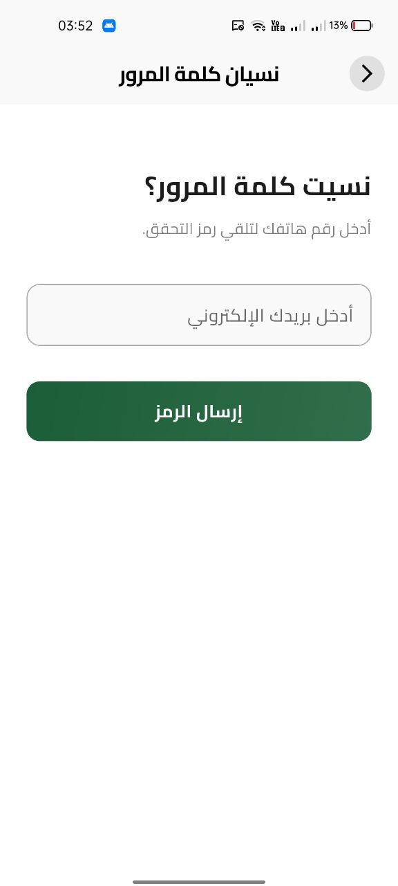

# 🍎 Fruits E-Commerce App

A feature-rich e-commerce app built with **Flutter**. The Fruits E-Commerce App offers a seamless fruit shopping experience with a powerful admin dashboard, secure payments, and a modern UI tailored for fruit lovers.

---

## 📸 Cover Image
  
*Cover image of the app.*

---

## ☀️ Light Mode Screenshots

### 1. Authentication & Onboarding
<table>
  <tr>
    <td></td>
    <td></td>
    <td></td>
    <td></td>
  </tr>
  <tr>
    <td></td>
    <td></td>
  </tr>
</table>

### 2. Home & Navigation & Search
<table>
  <tr>
    <td></td>
    <td></td>
    <td></td>
    <td></td>
  </tr>
  <tr>
    <td></td>
    <td></td>
  </tr>
</table>

### 3. Product Display & Reviews
<table>
  <tr>
    <td></td>
    <td></td>
    <td></td>
    <td></td>
  </tr>
</table>

### 4. Cart & Checkout
<table>
  <tr>
    <td></td>
    <td></td>
    <td></td>
    <td></td>
  </tr>
  <tr>
    <td></td>
    <td></td>
    <td></td>
  </tr>
</table>

### 5. User Profile
<table>
  <tr>
    <td></td>
    <td></td>
    <td></td>
    <td></td>
  </tr>
</table>

### 6. Notifications
<table>
  <tr>
    <td></td>
    <td></td>
    <td></td>
    <td></td>
  </tr>
</table>

### 7. App Utilities
<table>
  <tr>
    <td></td>
    <td></td>
    <td></td>
    <td></td>
  </tr>
</table>

### 8. Additional Features
<table>
  <tr>
    <td></td>
    <td></td>
    <td></td>
    <td></td>
  </tr>
</table>

---

## 🌙 Dark Mode Screenshots

### 1. Authentication & Onboarding
<table>
  <tr>
    <td></td>
    <td></td>
    <td></td>
    <td></td>
  </tr>
</table>

### 2. Home & Navigation & Search
<table>
  <tr>
    <td></td>
    <td></td>
    <td></td>
    <td></td>
  </tr>
  <tr>
    <td></td>
    <td></td>
  </tr>
</table>

### 3. Product Display & Reviews
<table>
  <tr>
    <td></td>
    <td></td>
    <td></td>
    <td></td>
  </tr>
</table>

### 4. Cart & Checkout
<table>
  <tr>
    <td></td>
    <td></td>
    <td></td>
    <td></td>
  </tr>
  <tr>
    <td></td>
    <td></td>
  </tr>
</table>

### 5. User Profile
<table>
  <tr>
    <td></td>
    <td></td>
    <td></td>
    <td></td>
  </tr>
</table>

### 6. Notifications
<table>
  <tr>
    <td></td>
    <td></td>
    <td></td>
    <td></td>
  </tr>
</table>

### 7. App Utilities
<table>
  <tr>
    <td></td>
    <td></td>
    <td></td>
    <td></td>
  </tr>
</table>

### 8. Additional Features
<table>
  <tr>
    <td></td>
    <td></td>
    <td></td>
    <td></td>
  </tr>
</table>

---

## ✨ Features
- **Profile Management** – Personalized profiles to track orders and preferences.
- **Search Functionality** – Quickly find your favorite fruits.
- **Dynamic Themes** – Light, dark, and custom theme options.
- **Animated Splash Screen** – Smooth branded animations.
- **Shopping Cart** – Real-time updates and total calculation.
- **Reviews System** – Submit and read product reviews.
- **Favorites** – Save and manage favorite fruits offline.
- **Discounts** – Smart discount logic powered by Supabase.
- **Localization** – Arabic 🇪🇬 and English 🇺🇸.
- **Admin Dashboard** – Manage products, reviews, and discounts.
- **Secure Checkout** – PayPal integration.
- **Notifications** – Real-time updates for orders and promotions.

---

## 💭 Conclusion
The **Fruits E-Commerce App** is your go-to platform for a delightful fruit shopping experience. With secure payments, an intuitive admin dashboard, and a customizable UI, it helps users and administrators stay productive and engaged. 🍓✨

---

## 📥 Download

---

## 📬 Contact
- **LinkedIn**: [Sayed Mostafa](https://www.linkedin.com/in/sayed-mostafa2004)
- **Email**: [sayed.mostafa.attia1@gmail.com](mailto:sayed.mostafa.attia1@gmail.com)
